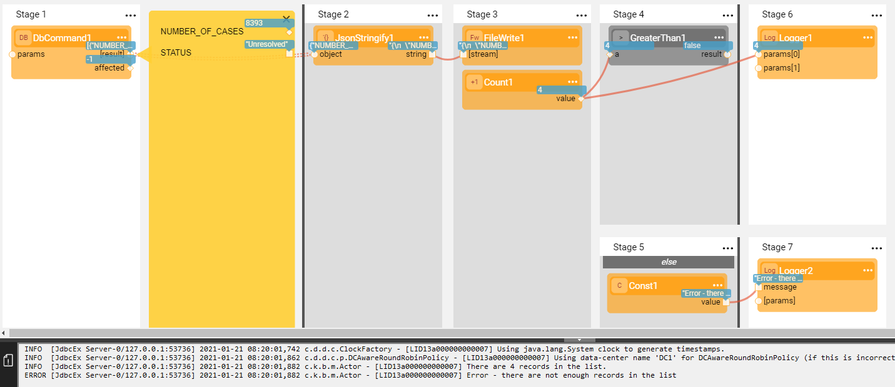

# Iterations and Conditions in a Flow

### Solution - Add a Condition to a Broadway Flow Exercise 

**Step 5.1**

<ul>
 <pre><code> 
A. The output value of the <strong>Count</strong> Actor is 4. This is the number of the records returned by the <strong></strong>DbCommand</strong> Actor.
B. The output value of <strong>GreaterThanEquals</strong> Actor is <strong>true</strong>.
C. <strong>Stage 6</strong> has been executed since the condition returned <strong>true</strong>.
D. The following messsage has been given by the Logger Actor of Stage 6 <strong>INFO: There are 4 records in the list.</strong>
</code></pre>
</ul>

**Step 5.3**

<ul>
<pre><code>
A. The output value of <strong>GreaterThanEquals</strong> Actor is <strong>false</strong>.
B. <strong>Stage 7</strong> has been executed since the condition returned <strong>false</strong>.
C. The following messsage has been given by Stage 7's Logger Actor: <strong>ERROR: Error - there are not enough records in the list.</strong> 
Stage 6 and 7 Logger Actors have set different message levels since each has a different value in the level input parameter.
</code></pre>
</ul>

 **Step 5.4**

<ul>
<pre><code>
A. Both <strong>Stage 6 and 7</strong> are executed. 
This is because the condition is now inside the iteration thus it is effective in the iteration scope only.
</code></pre>
</ul>

​		

