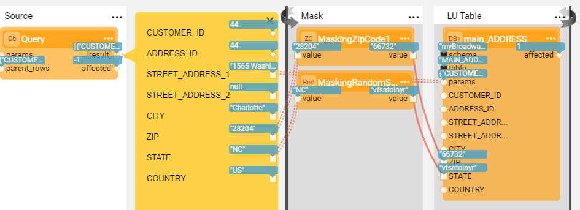

# Masking and Sequence Actors

Data Management Systems like **TDM** often handle sensitive data. To be compliant with Data Privacy laws, Fabric provides a **masking** category of Actors that can mask sensitive fields like SSN, credit card numbers and email addresses before they are loaded into the target DB.

For example: 

* The **MaskingSSN** Actor masks the original SSN number with a valid fake SSN.
* The **MaskingCreditCard** Actor generates a fake but valid credit card number similar to the original one.

Note that if data needs to be masked before it is loaded to Fabric, **Masking** Actors can be used in Broadway population flows.

Another important functionality for systems that need to frequently load data to target DBs is the ability to generate and populate a unique sequence ID.

The **MaskingSequence** Actor, which also belongs to the **masking** category, generates a unique sequence ID based on the provided input arguments.

<!--[Click for more information about TDM7 implementation]().  TBD !!!-->

### How Do I Set Masking Input Arguments?

The common input arguments of the **masking** category of Actors are:

* **maskingId**, a unique masking identifier used to generate a target value. To use the same masking Actor in different flows of the same project, use this parameter to refer to the same masking cache.
* **useExecutionID**, indication whether to use the Execution ID during the flow run whereby the Execution ID is a unique string generated each time the flow is running. Set to **true** to generate a new masked value in each execution. When set to **false**, the same masked value is used across different executions.
* **hashedInputValue**, indication whether to store the original or the hashed input value. By default the hashed value is stored. Set to **false** when it is required to disable caching and store the original value.
* **interface**, the interface to be used to cache the masked values. This interface might be either any SQL DB interface defined in Fabric or the Fabric server memory. 
  * When SQL DB interface is set, the **masking_cache** table under the [k2masking keyspace](/articles/02_fabric_architecture/06_cassandra_keyspaces_for_fabric.md) is used to cache the masked values. The data kept in this table reflects the settings of the Actor's input arguments.
  * If the **k2masking** keyspace does not exist, create it using the **masking-create-cache-table.flow** example or using the installation SQL script provided as part of the Masking library. 
  * IN-MEMORY interface is useful for testing purpose only since it can only be used by a single node configuration.
* **verifyUnique**, determines whether different input values can be masked to the same masked value. The uniqueness is checked per **maskingId** and Execution ID. Set this parameter to **true** if the masked value should be unique. For example, when masking an SSN, the masked value must be unique.

The following input arguments are specific to the **MaskingSequence** Actor:

* **sequenceInterface**, the interface where the sequence is defined with the name stored in the **maskingId** input argument.
* **initialValue** and **increment**, define the initial value of the sequence and the value of the increment. 

### How Do I Mask Data using Masking Actors?

The following example shows how to mask an Address description and  ZIP Code using two Actors of the **masking** category in the population flow. 

The same masking can be implemented in several flows of the same project. For example, if the ZIP Code is populated in several LU tables in Fabric, use the same Actor in the flows and specify the same Masking ID.

### How Do I Use the MaskingSequence Actor?

The purpose of the **MaskingSequence** Actor is to enable the implementation of a sequence's solution when creating Broadway flows that load data into a target DB.

The following example shows how to use a **MaskingSequence** Actor to generate a new sequence for a Customer ID instead of the original one.

