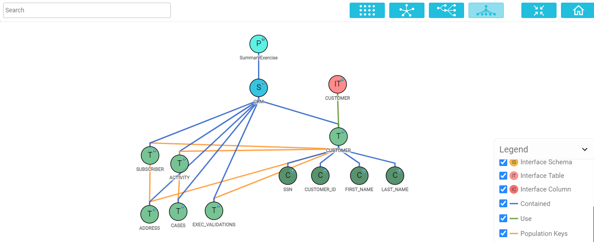

# Build and Write Data Catalog

A Data Catalog implementation must be deployed to the server side so that all changes are compiled and ready for use. This is done using one of the following options in the Fabric Studio:

* **Build Catalog**, builds the catalog files of all the project entities (each LU, WS, Common). 
  * The files are created in JSON format in the Resources folder of the project entities  - one file for each project entity. 
  * All the files are named **auto.catalog**, except for the file created under Shared Objects that is named **shared.catalog**. 
  * The catalog supports [overriding automatic files](06_override_data_catalog.md) to include the additional elements if the automatic process doesn’t find them or if they are not part of the project.

* **Write Catalog**, deploys the catalog to the server. This includes building the catalog files of all the project entities (each LU, WS, Common) and uploading them to OrientDB. 
  * Once Write Catalog is completed, login to the K2View Web Framework and navigate it. 
  * Note that Write Catalog can also be performed by running the [CATALOG WRITE](08_catalog_commands.md) command in the Fabric Server. In this scenario, the automatic files must be created before running the command using Build Catalog from the Fabric Studio.

### How Do I Build the Catalog?

1. In the Fabric Studio, right click the **Project** and select **Data Catalog > Build Catalog**. 

   

2. The build is executed and the results are displayed in the popup screen indicating the status of each project entity (LU, WS, Common). If there are problems, an error is displayed in the popup screen.

3. Open the created catalog files. For example, to open the catalog file of the WS:

   * Go to **Web Services > Resources** and double click **auto.catalog**.

### How Do I Write the Catalog?

1. In the Fabric Studio, right click the **Project** and select **Data Catalog > Write Catalog To debug** or **Write Catalog To Server**. 
2. Alternatively, run the [CATALOG WRITE](08_catalog_commands.md) command in the Fabric Server. 
3. The Catalog Write command is executed and the results are displayed in the popup screen indicating the status of each project entity (LU, WS, Common). If there are problems, an error is displayed in the popup screen.

Note that you must perform **Write Catalog** to apply the changes in the catalog to the server.

### Example of the Catalog Creation Process

1. Create a new project or use an existing one, for example the **testCatalogDB** project with the **Customer** LU, WS and Reference tables.

2. Create a  [Data Catalog interface](02a_data_catalog_interface.md) named **catalogdb**. This is a one-time activity.

3. [Install OrientDB](07_OrientDB_setup.md) and start it. This is a one-time activity.

4. Right click the **Project** and select **Data Catalog > Write Catalog To debug**.

5. Login to the Data Catalog using the K2View Web Framework to navigate the catalog:

   

 
