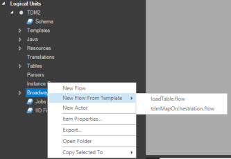

# Using Templates

Once templates have been added to a project, they can be used to create new objects. 

For more information, click  [Creating and Editing templates](02_create_and_edit_template.md).

1. Go to the Fabric Studio project tree and right click Create New Object.

2. Select "New \<object-type\> from Template".

3. Select the template from the list. Note that the list displays the templates which defined as Shared Objects or defined in the LU and only those of the specific object type. For example, when creating a new Java file, Java templates are displayed.

   

4. Populate the expressions / placeholders in the Template Parameters popup window, if such exist. The same information is displayed in the Template Parameters and JSON format tabs.  

   

   

Once the object is created it can be updated, when needed.

   

  
