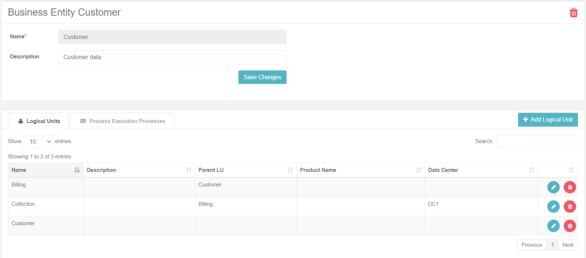
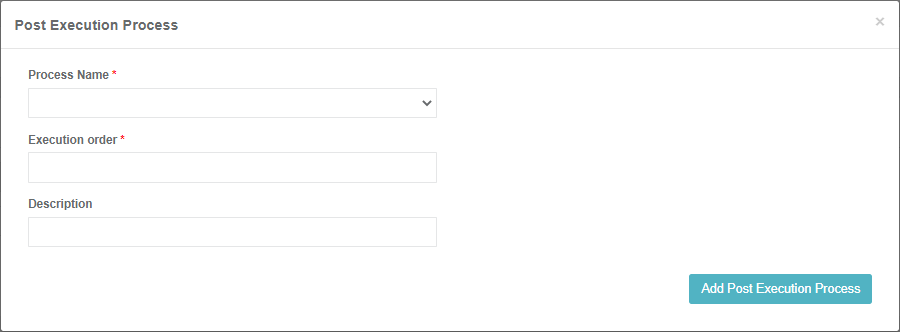

# Business Entity Windows 

A [Business Entity](/articles/TDM/tdm_overview/03_business_entity_overview.md) (BE) represents the main entity of the data to be provisioned by TDM. A Business Entity can have multiple [LUs](/articles/03_logical_units/01_LU_overview.md) with a flat or  hierarchical structure. For example, a Customer Business Entity can have Customer Care, Billing, Ordering and Usage LUs. Each LU can be attached to multiple BEs.

## Business Entities List Window  

The **Business Entities** window displays a list of all Business Entities defined in the TDM.  Only **Admin users** can create, edit, or delete a Business Entity. Other users can open the Business Entities for view only purposes.

-   To create a new Business Entity, click the **New Business Entity** icon.
-   To open a selected Business Entity, click the **Name** value of the Business Entity.
-   To delete a Business Entity, click the  icon in the right corner of the Business Entity window.

## Business Entity Window    

The Business Entity window displays information about a selected Business Entity. It has three main sections:

- General Information holding the Business Entity Name and Description fields.
- Logical Units tab.
- Post Execution Processes tab.

The following is an example of a Customer Business Entity window:

### General Information Section 

The General Information section holds the BE **Name** and **Description**. The Name setting is mandatory. Note that only one active BE can have a specific Name. An error is displayed when an attempt is made to create several BEs with the same name.

### Logical Units Tab 

To use a BE in a TDM task, it must have one or more LUs assigned.

#### How Do I Add an LU to a BE? 

1. Click the **Add Logical Unit** button to display the **Add Logical Units** dialog box:

2. Do the following: 
   - Check **All Logical Units** to attach all LUs that are deployed to Fabric and that are not attached to the BE.
   - Check **Select** and select the available LUs from the **Logical Unit** dropdown list.
   - Click  or  to add or remove LUs to / from the BE. 
   - Populate the following optional settings on each selected LU:
     - **Logical Unit Description**
     - **Parent Logical Unit**,  set a parent LU to build a [hierarchy in the BE](/articles/TDM/tdm_overview/03_business_entity_overview.md). 
     - **Data Center**, which can be attached to each LU in a Business Entity if the LU instances are saved under a specific Data Center (DC) in Fabric.
 3. Click **Add Logical Units** to add the selected LUs to the BE.

Notes:
 - Both Parent and Child LUs must be attached to the same BE.
 -  An LU can have 0-1 parents.
 -  An LU can have 0-N children.
  - Several levels of parent-child hierarchies can be defined in a BE. For examples, see the [Business Entity Overview](/articles/TDM/tdm_overview/03_business_entity_overview.md).

#### Editing LU Settings

Click  or  to edit or delete the LU from the BE. Note that the LU is deleted from the BE in the TDB DB. 

[Click for more information about TDM DB tables in a BE  and LU relationship].

### Post Execution Processes Tab

This tab enables adding post-execution processes that must run at the end of the task's execution after all the related LUs have been executed. For example, sending a mail to the tester to notify them that the execution of a task has ended. 

Post-execution processes are [Broadway flows] defined in Fabric by the TDM implementer. The relationship between a post-execution process and a BE is many to many, i.e. a BE can have several post-execution processes, and a post-execution process can be attached to multiple BEs. 

The [task execution process] executes the [BATCH command](/articles/20_jobs_and_batch_services/15_batch_broadway_commands.md) on each post-execution process attached to task's BE. The execution order is set according the execution order defined in the BE.

Unlike for LUs, post-execution processes are optional. A BE can be defined without any post-execution processes.

#### How Do I Add a Post Execution Process to a BE? 

1. Open the **Post Execution Processes** tab and click the **Add Post Execution Processes** button to open the **Post Execution Process** dialog box.  

2. Click the **Process Name** and select the post-execution processes from the dropdown list holding all post-execution processes deployed to Fabric.

3. Populate the **Execution Order** setting with a numeric value to set the execution order. The processes with execution order 1 run first followed by the process with execution order 2 etc. Note that an execution order can be set for several post-execution processes that are executing simultaneously.

4. Populate the **Description** (optional).

5. Click the **Add Post Execution Process** button to add the post-execution process to the BE.

  

[Click for more information about BE TDM DB tables and the post-execution processes relationship].

 

  

