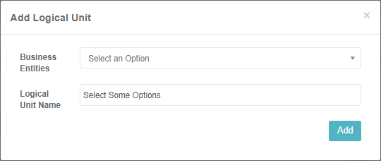

# Product Windows

A TDM Product represents a system or application installed in the source or target environment. For example, the UAT1 environment contains CRM and Billing products. Each product can have multiple data sources (interfaces). For example, the Billing product has the Billing and Usage DBs.

A TDM Product contains the following components:

- Product name - a logical name to identify the product (system). For example, CRM.
- Product versions - the versions of the product, as defined in the testing environments. For example, Production and Development.

- Logical Units (LUs).

## BE - LU - Product Relationship

Each combination of BE and LU can be attached to one product only. However, a product can have LUs that belong to different BEs.

The following example displays the relationship between the BE, LU, and Product:

## Products List Window

The **Products** window displays a list of all Products defined in the TDM.  Only **Admin users** can create, edit, or delete a Product. Other users can open the Products for a view.

-   To create a new Product, click the **Add Product** button.
-   To open a selected Product, click the Product's **Name**.
-   To delete a Product, click the  icon in the right corner of the Product window.

## Product Window

The Product window displays information about a selected Product. It has two main sections:

- General Information.
- Logical Units.

### General Information

The general information section contains the following settings:

- Name  - product name

- Vendor and Description - optional settings

- Versions - product versions:

  -  The product versions enable the TDM implementation to support multiple versions of the product when each product version may have a different data source structure. For example , a development environment may have new tables and fields comparing the production environment. 
  - At least one version must be set on the Product. It is possible to set multiple product versions. 
  - The relevant product version must be selected when adding an Product to an [Environment].
  - To add a version to the Product, click the   icon next to the Product Versions setting. A popup window is opened. Type the version value. The version value is the logical identifier of the product version,  for example 1, 1.5, dev or prod. The values must be aligned to the TDM Fabric implementation. 

  [Click for more information about supporting multiple Product versions by TDM].

### Logical Units

#### How to add an LU to a Product ?

- Click the  icon to add an LU to the Product.  A popup window is opened:

  

- The **Business Entities** setting displays the list of BEs which have available LUs that are not attached to any product.

- The **Logical Unit Name** setting displays the list of available LUs (not attached to any product) of the selected BE.

  

#### How to Delete an LU from a Product ? 

- Click the  icon to  delete the selected LU from the Product.

  [Click for more information about the Product related TDM DB tables](/articles/TDM/tdm_gui/06_be_product_tdmdb_tables.md).

 