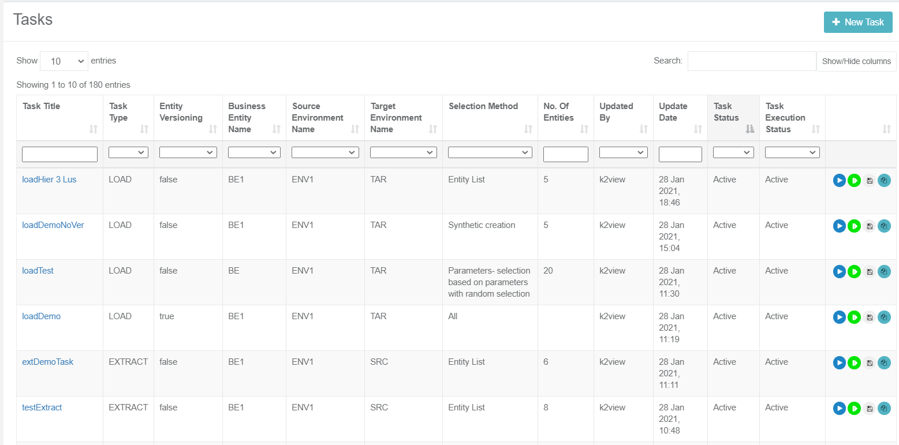
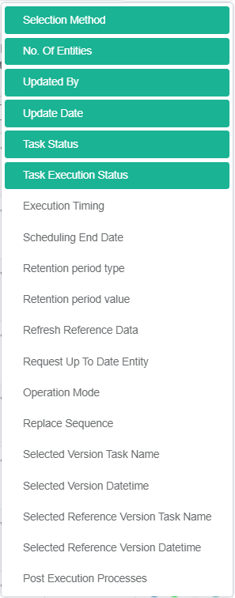

# TDM Task Overview

Data provisioning is implemented by creating and executing TDM tasks. TDM tasks are created via the TDM GUI. 

The TDM task contains the list of instructions and settings to define the type and subset of processed entities, the source and target environments, and additional information.  For example, create a task to copy 5 Customer with a Small and Medium Business plan from Production into the UAT1 target environment.

The actual data provisioning is performed by the task execution Each task can be executed multiple times.

The following task types are supported by the TDM:

- Extract task, extracts the selected entities or Reference tables from the selected source environment and saves this data in Fabric for later use.

- Load task, extracts the selected entities or Reference tables from the selected source environment and copies (provisions) them to the selected target environment.

The TDM supports two possible task modes on each task type:

- [Data Flux], enables users to backup versions of data and reload it to the testing environment if needed. Check the **Entity Versioning** to create a Data Flux task. 
- Regular, this is the default mode.

## Who Can Create a Task?

The following user types can create a TDM task:

1. Admin users
2. Environment owner users can create a TDM task on their environment
3. Other users (testers) can create a TDM task on the environments they are attached to by a [role](/articles/TDM/tdm_gui/10_environment_roles_tab.md):
   - Source environment, the user must be attached to the source environment by a role with a [Read](/articles/TDM/tdm_gui/10_environment_roles_tab.md#read-and-write-and-number-of-entities) access.
   - Target environment, the user must be attached to the target environment by a role with a [Write](/articles/TDM/tdm_gui/10_environment_roles_tab.md#read-and-write-and-number-of-entities) access.

## TDM Tasks List Window

Displays the list of the TDM tasks and the main information of each task:

- Task Title (task name)

- Task Type : Load / Extract

- [Entity Versioning] : true / false

- BE name

- Source and Target environments 

- Selection criteria for entities

- Number of processed entities

- General parameters: created by user, update date ... 

  See example below: 

  

  

  Click on **Show/Hide Columns** button to show or hide the displayed fields. A popup window is opened with the list of available fields for each task.  The fields in green are displayed by default. To display additional fields, click on the required fields. To remove a field from the display, click on the field:

You can search for a task using the **Search** setting, and filter the displayed tasks by the filter fields.

The TDM GUI displays a list of icons next to each task record:

- [Execute Task] 
-  [Hold Task] : temporarily set the task on-hold
- [Save As] : copy the task into a new task
- [Task Execution History] : view the execution history of the selected task

 

