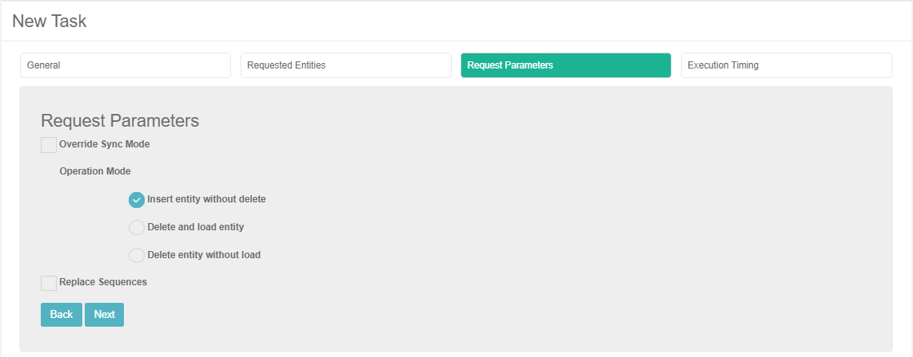

# TDM Load Task - Request Parameters Tab

This tab defines the general parameters defined at a task level and impact all processed entities. See example below:

The following task parameters can be set: 

### Override Sync Mode

By default the **Override Sync Mode** setting is unchecked. When checked, you can override the default Sync mode when the task is executed:

The following options can selected to override the Sync mode:

- **Do not Sync Source Data**: get the data from Fabric and do not access the source environment.
- **Request Up to Date Entity**: set the Sync mode of the task execution to [Force](https://github.com/k2view-academy/K2View-Academy/blob/Academy_6.4_TDM/articles/TDM/tdm_gui/articles/14_sync_LU_instance/02_sync_modes.md) to get the most update data of the processed entities. A tester can select this option only if their **Read** [role](10_environment_roles_tab.md#role-permissions) enables it.

### Operation Mode

Select an operation mode from the following options:

#### Insert Entity without Delete

This is the default option. The selected entities are inserted into the target environment without a preliminary delete of these entities. The the processed entity IDs already exist in the target environment, the task execution will fail due to unique constraints violation. Therefore it is recommended to use this option if the target environment is empty, or if the task replaces the sequences of the processed entities before loading them to the target.

#### Delete and Load Entity

The selected entities are deleted from the target testing environment, and then re-loaded into the environment. This option is required when a tester wishes to repeat a test for specific entities and needs a new copy of these entities in the target environment.

#### Delete Entity without Load

The selected entities are deleted from the target testing environment without being re-loaded to the environment. This option is selected when a tester needs to clean entities from their environment.

Notes:

- A tester can select one of the delete options if their **Write** [role](10_environment_roles_tab.md#role-permissions) enables it.
- The delete flows must be implemented in the Fabric implementation. Click for more information about the [delete implementation].
- The delete options are not displayed on a task with a [Create Synthetic Entities](18_load_task_requested_entities_regular_mode.md#create-synthetic-entities) selection method, since the Synthetic method creates new clones (replicas) of the selected entity. 

Click for more information on [how overriding the sync mode and the task operation mode impact the task execution] process.

### Replace Sequences

When checked, the task execution process replaces the sequences of all selected entities before loading the entities into the target. This option is required to avoid sequence duplications if the testing environment is not empty and contains entities.

Notes:

- A tester can check this setting if their **Write** [role](10_environment_roles_tab.md#role-permissions) enables it.
- The Replaced Sequence setting is not displayed on a task with a [Create Synthetic Entities](18_load_task_requested_entities_regular_mode.md#create-synthetic-entities) selection method, since the Synthetic method creates new clones (replicas) of the selected entity and replaces the sequences on each clone.
-  The Replaced Sequence setting is not displayed when selected the **Delete Entity without Load** as an operation mode, since the TDM task only deletes the selected entities and does not load a new data into the target environment.
- The Replace Sequence must be implemented in the Fabric implementation. Click for more information about the [delete implementation].

 

