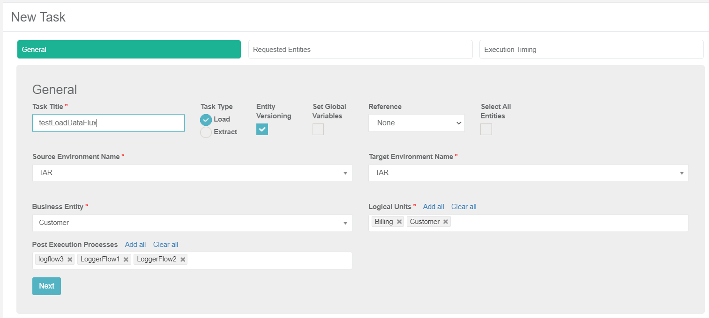

# TDM Load Task - Data Flux Mode

A [Data Flux Load task] gets the selected entities or Reference tables from the selected version created on the source environment and loads them to the selected target environment. A load task deletes the selected entities from the target environment and then loads them from the selected version.

A load task is set to a Data Flux task by checking the **Entity Versioning** setting.

Click for more information about [Data Flux tasks](15_data_flux_task.md).

A Load Data Flux task contains the following tabs:

- [General](#general)
- [Requested Entities](21_load_task_requested_entities_dataflux_mode.md)
- [Execution Timing]():   this is the last tab of the Task window and is available for all task types and modes. The following options are available  for the task execution:
- **Execution by Request**: the default option.
  - **Scheduled execution**: set scheduling parameters to automatically execute the task based on the scheduling parameters. Note that a tester can select this option only is its role has a scheduling permission.

When checking the **Set Global Variables** setting, a new tab is opened: [Task Globals].

When setting the **Reference** setting to **Reference Only** or **Both - reference and entities**, a new tab is opened: [Reference].

## General

This is the first tab of the TDM task and holds a general information of the task. See example below:

### Task Title

- A task name. A mandatory setting. Note that only one active task can have a specific Task Title. An error is displayed when an attempt is made to create several tasks with the same task title.

### Task Type

- Load or Extract. Set the task type to **Load**.

### Entity Versioning

- Check to set the task mode to [Data Flux](15_data_flux_task.md).  A tester can create check this setting and create a Data Flux load task only if his permitted to select this method by their [role](10_environment_roles_tab.md#role-permissions) on the target environment.

  

### Set Global Variables 

- Check to [override Globals on a task level].

### Reference 

[Reference handling]. Select a value from the dropdown list:

- **None**: default value. Do not include Reference tables in the task.
- **Reference Only**: create a task to extract Reference tables only into Fabric. Do not include entities in the task.
- **Both - reference and entities**: create a task to extract both - entities and Reference tables - into Fabric.

### Select All Entities

- When checked, all entities of the selected version will be re-loaded to the target environment.
- Only Admin and Environment owner users can check the **Select All Entities** settings. Other users can only define a list of entities in the [Requested Entities] tab.

### Environment Names

- Select a **source environment** from the dropdown list of the active TDM environments with [environment type](08_environment_window_general_information.md#environment-type) **Source** or **Both**. 
- Select a **target environment** from the dropdown list of the active TDM environments with [environment type](08_environment_window_general_information.md#environment-type) **Target** or **Both**. 
- Notes:
  - Tester users can only select source environment they are attached to by a Read [role](10_environment_roles_tab.md) and target environment they are attached to by a Write [role](10_environment_roles_tab.md). 
  - The tester will usually select the testing environment as both - source and target environments - when creating a Data Flux load task to re-load the previously created version of the testing data on the environment.

### Business Entity

The [BE](04_tdm_gui_business_entity_window.md) of the task. Select a BE from the dropdown list of the [BEs](05_tdm_gui_product_window.md#be-and-lu-product-relationship) included in the [environment’s products](11_environment_products_tab.md). 

### Logical Units

Select all, partial, or one LU of the selected BE. 

The following validations are set on the selected LUs:

The selected LUs must include at least one [root LU](/articles/TDM/tdm_overview/03_business_entity_overview.md#root-lu) of the selected BE. 

You cannot select an LU without its parent LU. 

**Example:**

- Customer BE has two level in its hierarchy: the  root LU is the Customer Data, the Billing LU is a child of the Customer Data, and the Collection LU is the child of the Billing LU. You cannot select a the Collection LU without the Billing LU when creating a task on Customer BE.

Click for additional [examples of BE's hierarchies](/articles/TDM/tdm_overview/03_business_entity_overview.md).

### Post Execution Processes

Select all, partial, or one [post execution process](04_tdm_gui_business_entity_window.md#post-execution-processes-tab) of the selected BE.

 

