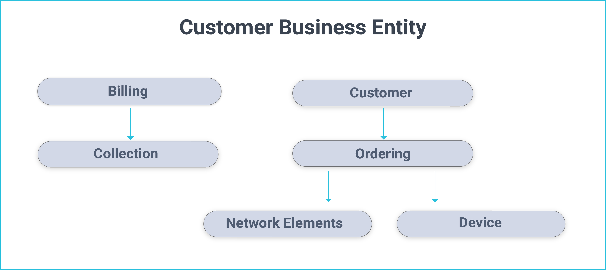

# Business Entity Overview

### What is a Business Entity? 

A Business Entity (BE) represents the main entity of the selected data to be provisioned by TDM.  Business Entities can have multiple [LUs]((/articles/03_logical_units/01_LU_overview.md)) with a flat or a hierarchical structure. For example, a Customer Business Entity can have Customer Care, Billing, Ordering  and Usage LUs.

Each LU can be attached to multiple BEs.

The ability to break a BE up into several LUs enables maximum flexibility and avoiding duplicate development. In addition, defining a hierarchical structure of parent-child LUs enables creating LUs based on the natural root entity of the related data sources instead of forcefully setting unified root entities on all LUs related to a given BE.

**Example**

- Customer's LU root entity = Customer ID.
- Ordering LU's root entity = Order ID.
- Network element LU's root entity = Element ID.
- Device LU's root entity = Device ID.
- Ordering, Network and Device LUs are attached to two BEs:
  - Customer. 
  - Ordering.

 

 

Users can request to copy a list of selected Customer IDs, whereby the TDM task also copies the related ordering, network elements and device data of the selected customers.
Alternatively, users can request to copy a list of selected Order IDs whereby the TDM task also copies the related network elements and device data of the selected orders.

BEs are defined via the TDM GUI and are saved in the [TDM DB](/articles/TDM/tdm_architecture/02_tdm_database.md).

### Building an LU Hierarchy in a BE

A parent-child hierarchy of LUs can also be defined under a BE. The relationship between the **parent and child** LUs is **one to many**. Each parent LUI can have many child LUIs. 

If an LU in a BE has no parent LU, it is named **Root LU** whereby its root entity equals the root entity of the BE. 

**Customer #1 Hierarchy Example**

 
                                

-  The Customer LU is the **Root LU** of the Customer BE.
-  Each LU has its own LUs. 

When creating a TDM task to copy Customer 1 from the PROD environment, the TDM task must also copy the customer's related billing accounts and orders together with the related network elements and devices of the related orders. 

The following LUIs are extracted from the source and created in Fabric for Customer 1:

 <table width="900 pxl">
<tbody>
<tr>
<td valign="top" width="250 pxl">
<strong>LU Name</strong>
</td>
<td valign="top" width="250 pxl">
<strong>Parent LU Name</strong>
</td>
<td valign="top" width="400 pxl">
<strong>LU Instances</strong>
</td>
</tr>
<tr>
<td valign="top" width="250 pxl">
Customer
</td>
<td valign="top" width="250 pxl">
&nbsp;
</td>
<td valign="top" width="400 pxl">
PROD_1
</td>
</tr>
<tr>
<td valign="top" width="250 pxl">
Ordering
</td>
<td valign="top" width="250 pxl">
Customer
</td>
<td valign="top" width="400 pxl">
PROD_89, PROD_90, PROD_91, PROD_92
</td>
</tr>
<tr>
<td valign="top" width="250 pxl">
Billing
</td>
<td valign="top" width="250 pxl">
Customer
</td>
<td valign="top" width="400 pxl">
PROD_10, PROD_11, PROD_12
</td>
</tr>
<tr>
<td valign="top" width="250 pxl">
Network Elements
</td>
<td valign="top" width="250 pxl">
Ordering
</td>
<td valign="top" width="400 pxl">
PROD_600, PROD_601, PROD_602, PROD_507, PROD_889, PROD_563, PROD_432
</td>
</tr>
<tr>
<td valign="top" width="250 pxl">
Device
</td>
<td valign="top" width="250 pxl">Ordering</td>
<td valign="top" width="400 pxl">
PROD_1000, PROD_1001, PROD_1002, PROD_1003, PROD_1004, PROD_1005
</td>
</tr>
</tbody>
</table>

#### TDM Hierarchy with Several Root LUs 

A TDM BE may include several root LUs with the same list of entities. For example, if the entity ID of both the Customer and Billing LUs is Customer ID, then the BE hierarchy may be:

 

 

 

 

 

 
