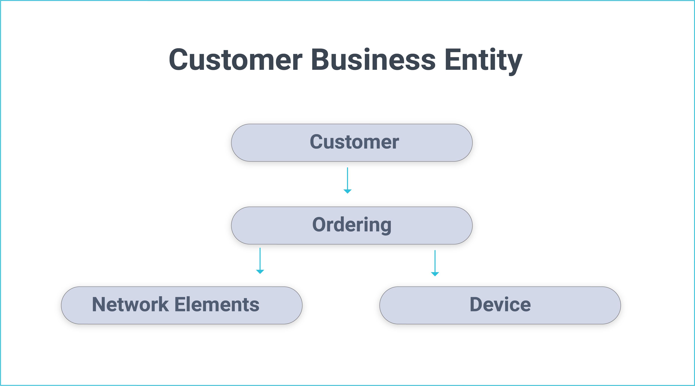
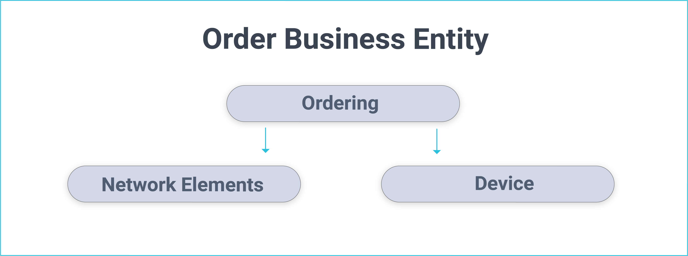
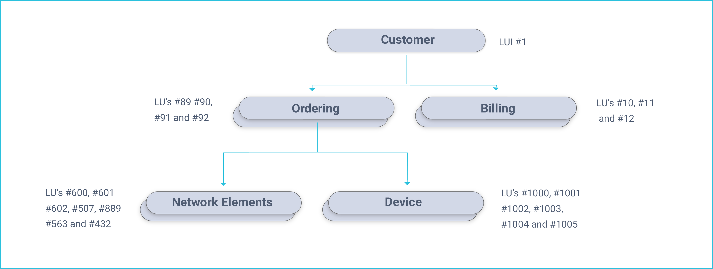

# Business Entity Overview

### What is a Business Entity? 

A Business Entity (BE) represents the main entity of the selected data to be provisioned by TDM.  Business Entities can have multiple [LUs]((/articles/03_logical_units/01_LU_overview.md)) with a flat or a hierarchical structure. For example, a Customer Business Entity can have Customer Care, Billing, Ordering  and Usage LUs.

-  BEs are defined in the TDM GUI and are saved in the [TDM DB](https://github.com/k2view-academy/K2View-Academy/blob/Academy_6.4_TDM_BCK/articles/TDM/tdm_architecture/02_tdm_database.md).
-  Each LU can be attached to multiple BEs. 

Breaking the BE into several LUs enables maximum flexibility and avoiding duplicate development. The hierarchical structure of parent-child LUs enables creating LUs based on the natural root entity of the related data sources instead of forcefully setting unified root entities on all LUs related to a given BE.

**Example**

- Customer LU root entity = Customer ID.
- Ordering LU root entity = Order ID.
- Network element LU root entity = Element ID.
- Device LU root entity = Device ID.
- Ordering, Network and Device LUs are attached to two BEs:
  - Customer. 
  - Ordering.

 The following BEs are defined in the TDM: 

 

You can request to copy a list of selected Customer IDs, whereby the TDM task also copies the related ordering, network elements and device data of the selected customers.
Alternatively, you can request to copy a list of selected Order IDs whereby the TDM task also copies the related network elements and device data of the selected orders.

### Building an LU Hierarchy in a BE

A parent-child hierarchy of LUs can also be defined under a BE. The relationship between the **parent and child** LUs is **one to many**. Each parent LUI can have many child LUIs. 

If an LU in a BE has no parent LU, it is named **Root LU** whereby its root entity equals the root entity of the BE. 

**Example of Customer #1 Hierarchy**

 
                                

-  The Customer LU is the **Root LU** of the Customer BE.
-  Each LU has its own LUs. 

When creating a TDM task to copy Customer 1 from the PROD environment, the TDM task must also copy the customer's related billing accounts and orders together with the related network elements and devices of the related orders. 

The following LUIs are extracted from the source and created in Fabric for Customer 1:

 <table width="900 pxl">
<tbody>
<tr>
<td valign="top" width="250 pxl">
<strong>LU Name</strong>
</td>
<td valign="top" width="250 pxl">
<strong>Parent LU Name</strong>
</td>
<td valign="top" width="400 pxl">
<strong>LU Instances</strong>
</td>
</tr>
<tr>
<td valign="top" width="250 pxl">
Customer
</td>
<td valign="top" width="250 pxl">
&nbsp;
</td>
<td valign="top" width="400 pxl">
PROD_1
</td>
</tr>
<tr>
<td valign="top" width="250 pxl">
Ordering
</td>
<td valign="top" width="250 pxl">
Customer
</td>
<td valign="top" width="400 pxl">
PROD_89, PROD_90, PROD_91, PROD_92
</td>
</tr>
<tr>
<td valign="top" width="250 pxl">
Billing
</td>
<td valign="top" width="250 pxl">
Customer
</td>
<td valign="top" width="400 pxl">
PROD_10, PROD_11, PROD_12
</td>
</tr>
<tr>
<td valign="top" width="250 pxl">
Network Elements
</td>
<td valign="top" width="250 pxl">
Ordering
</td>
<td valign="top" width="400 pxl">
PROD_600, PROD_601, PROD_602, PROD_507, PROD_889, PROD_563, PROD_432
</td>
</tr>
<tr>
<td valign="top" width="250 pxl">
Device
</td>
<td valign="top" width="250 pxl">Ordering</td>
<td valign="top" width="400 pxl">
PROD_1000, PROD_1001, PROD_1002, PROD_1003, PROD_1004, PROD_1005
</td>
</tr>
</tbody>
</table>

#### TDM Hierarchy with Several Root LUs 

A TDM BE may include several root LUs with the same list of entities. For example, if the entity ID of both the Customer and Billing LUs is Customer ID, then the BE hierarchy may be:

 

 

### Task Execution of Hierarchical Business Entities

A TDM task can include a BE with a hierarchical structure of several LUs. When processing the TDM task, all related LUs from parent and child LUs must also be processed:

1. Execute the Root LUs on all task entities.

2. After the parent LUs have been processed, execute the child LUs of the Root LUs on all entities, as follows:
   -  Execute each child LU on the related entity IDs of the parent's entities that have been successfully processed by the task.
   -  Execute their child LUs.

Note that if execution of the parent LU fails, the child LU is not processed and is marked as failed.

**Example:**

1. Create a TDM task to copy **Customers 1, 2 and 3** and with their orders and related network elements. 

2. **Customers' related entities:**

- **Customer 1:** 
  - Order 4 : 
    - Network elements 90 and 91.
  - Order 5:
    - Network element 92.

- **Customer 2 :**
  - Order 9: 
    - Network element 98.
- **Customer 3 :** 
  - Order 10:
    - Network element 99.
  - Order 11:
    - Network element 100.
  - Order 12:
    - This order has no related network element.

3. **Task execution order:**

- **Step 1:**
  - Run the Customer LU on  entities 1, 2 and 3. 
  - Customers 1 and 2 are processed successfully. Customer 3 fails.
- **Step 2:**
  - Run Order LU on entities related to Customers 1 and 2, i.e. order IDs 4, 5 and 9. The execution of Order 4 failed. The remaining Orders have been processed successfully. 
  - Note that Order LU is not executed on Customer 3 orders, since it failed.
- **Step 3:**
  - Run the Network Element LU on the entities related to the successfully processed Orders, i.e. Network Element IDs 92 and 98.

 

 
